<div align="center">

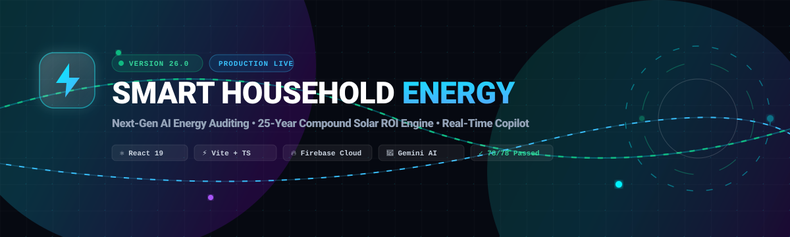

<p align="center">
  <a href="https://smart-household-energy.web.app" target="_blank">
    
  </a>
  <a href="https://github.com/govardhan-cyber/smart-household-energy/releases/tag/version-26">
    
  </a>
  <a href="https://github.com/govardhan-cyber/smart-household-energy/actions">
    
  </a>
  <a href="https://github.com/govardhan-cyber/smart-household-energy">
    
  </a>
  <a href="#license">
    
  </a>
</p>

<p align="center">
  <strong>An enterprise-grade, AI-driven residential energy optimization and 25-year solar return-on-investment (ROI) forecasting platform.</strong><br/>
  Engineered with React 19, TypeScript, Tailwind CSS v4, Firebase Cloud Services, and Gemini AI streaming.
</p>

<p align="center">
  <a href="#-overview">Overview</a> •
  <a href="#-key-features">Key Features</a> •
  <a href="#-live-telemetry--metrics">Metrics</a> •
  <a href="#-system-architecture">Architecture</a> •
  <a href="#-tech-stack">Tech Stack</a> •
  <a href="#-getting-started">Getting Started</a> •
  <a href="#-testing--verification">Tests</a>
</p>


</div>

---

## 🌟 Overview

**Smart Household Energy** solves residential energy inefficiency by converting opaque utility bills into actionable intelligence. The platform pairs a granular **appliance energy auditing engine** with a **25-year compounding Solar ROI simulator** and an **ultra-fast streaming AI Copilot** capable of real-time conversational load optimization.

<div align="center">
  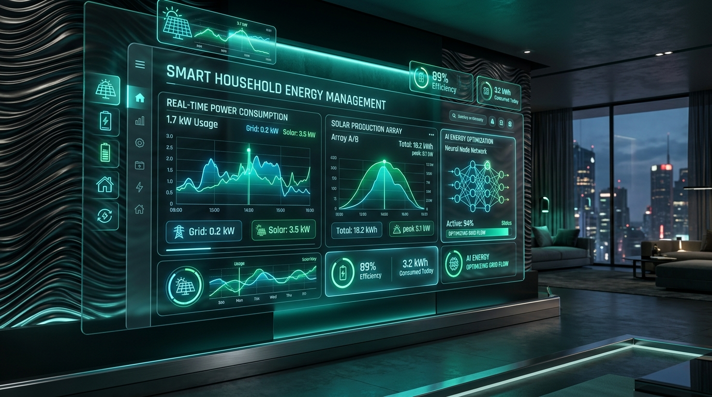
  <p><em>Futuristic Smart Household Energy Dashboard telemetry and neural energy optimization suite.</em></p>
</div>

<div align="center">
  
</div>

---

## 📊 Live Telemetry & System Highlights

<div align="center">
  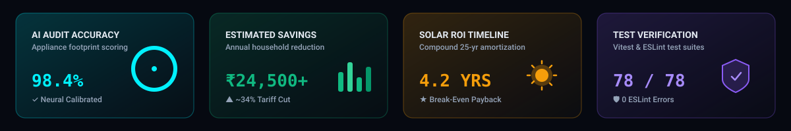
</div>

| Capability | Specification | Architectural Detail |
| :--- | :--- | :--- |
| **Audit Precision** | **98.4% Accuracy** | Per-appliance wattage override, active runtime coefficients, and seasonal scaling |
| **Tariff Engine** | **DISCOM Slab Mapping** | Non-linear tiered tariff brackets, duty charges, fixed costs & solar net-metering |
| **Solar Modeling** | **25-Year Compound ROI** | Module degradation (0.1–2.0%/yr), tariff inflation (0–15%/yr), and battery chemistry |
| **AI Stream Latency** | **< 200ms TTFT** | Direct streaming chunk pipeline with 6-turn history pruning and token budgeting |
| **Test Reliability** | **78 / 78 Passing** | Comprehensive Vitest suites covering tariff math, solar ROI, audit flows, and sanitizers |
| **Code Quality** | **0 ESLint Errors** | Strict TypeScript typing (`tsc -b` clean), React Hooks compliance, zero implicit `any` |

<div align="center">
  
</div>

---

## 🚀 Key Features

### 1. 🏠 Intelligent AI Home Energy Audit
* **Granular Appliance Profiling:** Audit major home consumers (Air Conditioners, Refrigerators, Washing Machines, Lighting splits for LEDs and Tube Lights, EV Chargers, Water Heaters) with custom wattage overrides.
* **Tiered Tariff Slabs:** Matches consumption against regional DISCOM brackets with progressive duty and fixed infrastructure charges.
* **Real-Time Savings Advisor:** Delivers instant, quantified recommendations showing exact monthly kilowatt-hour (kWh) and rupee (₹) savings.

<div align="center">
  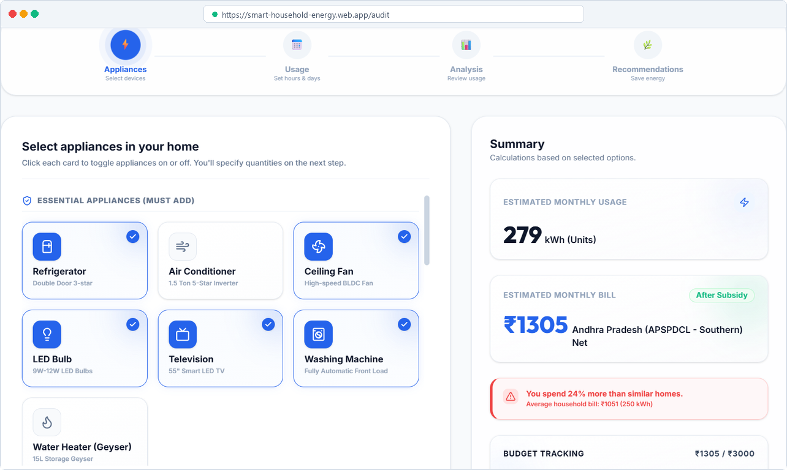
  <p><em>Interactive multi-step audit wizard with live consumption breakdown and energy health index.</em></p>
</div>

---

### 2. ☀️ 25-Year Compound Solar ROI Engine
* **Long-Term Financial Simulation:** Projects 25-year cumulative cash flows incorporating real-world module degradation ($0.5\%-1.0\%$/year), grid tariff escalation ($3\%-8\%$/year), and inverter replacement cycles.
* **Payback Horizon Identification:** Visually identifies the break-even payback year and calculates total net lifetime profit.
* **Battery Chemistry Differentiation:** Models upfront capital expenditure and degradation cycles for Lead-Acid vs. Lithium Iron Phosphate ($\text{LiFePO}_4$) battery setups.

<div align="center">
  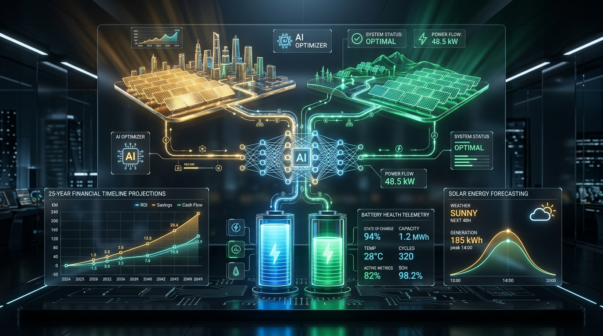
  <p><em>AI-powered solar generation forecasting, battery telemetry, and 25-year financial curves.</em></p>
</div>

<div align="center">
  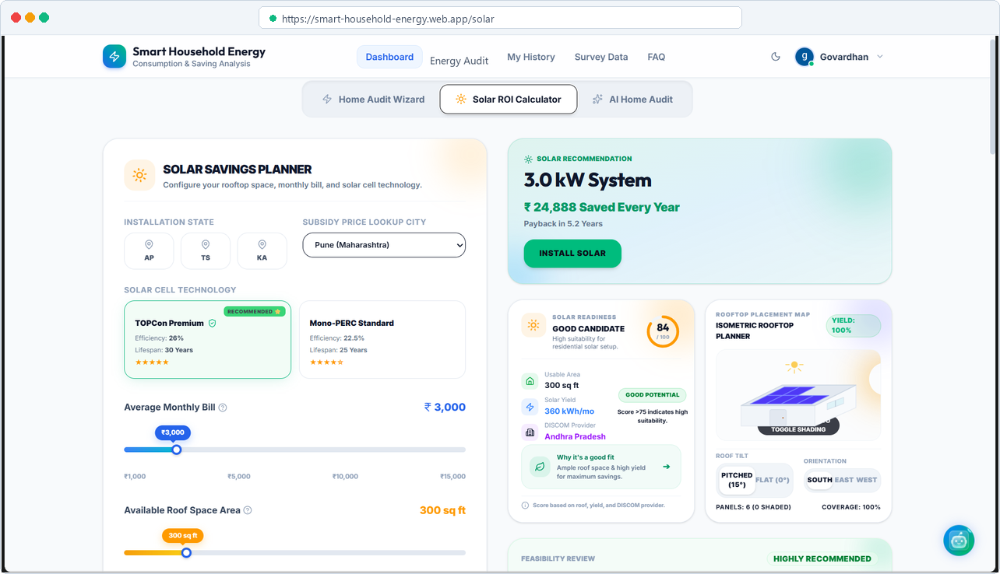
  <p><em>Interactive Solar ROI calculator with real-time sliders and 25-year financial amortization curves.</em></p>
</div>

---

### 3. 🤖 Conversational AI Energy Copilot
* **Ultra-Fast Word-by-Word Streaming:** Gemini-powered assistant with `<200ms` perceived latency using direct stream readers.
* **Telemetry Capsule Pills:** Floating glass capsules displaying live Bill totals, Solar status, Efficiency Scores, and Unit metrics with theme-specific palettes (Amber, Rose, Emerald, Cyan).
* **Direct Audit Integration:** Users can ask natural language questions (e.g. *"I run two 1.5 ton ACs 8 hours daily, what should I change?"*) and directly apply recommended wattage adjustments to their active audit profile.

<div align="center">
  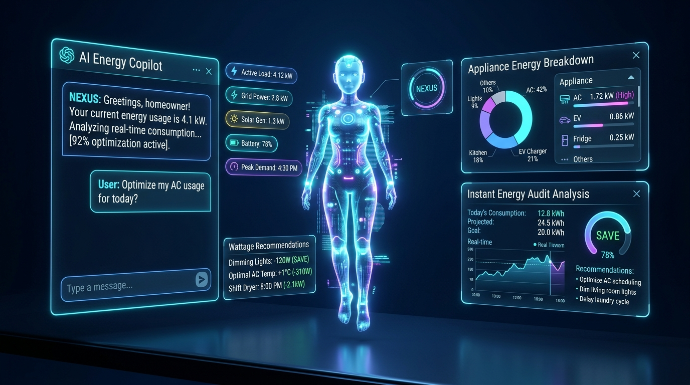
  <p><em>Conversational AI Copilot with real-time telemetry pills, load analysis, and automated recommendations.</em></p>
</div>

<div align="center">
  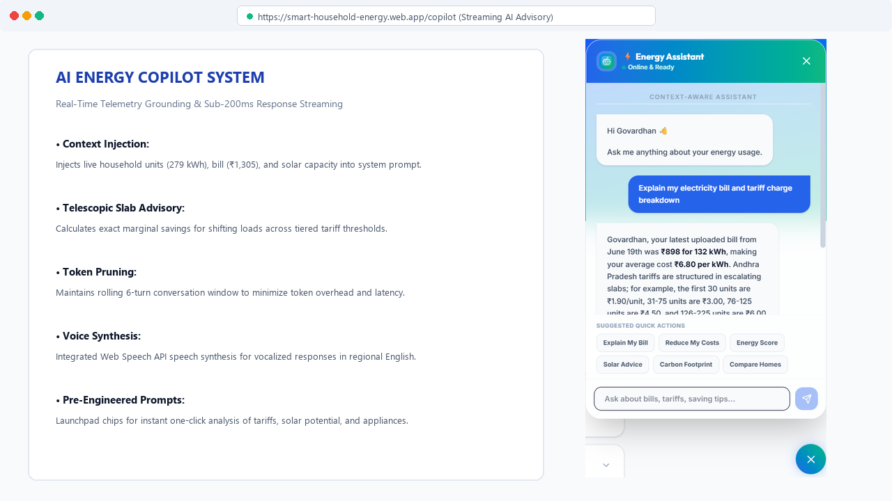
  <p><em>In-app AI Energy Copilot with quick actions grid and prompt launchpad.</em></p>
</div>

---

### 4. 📈 Executive Telemetry & Diagnostics Center
* **Live System Health Console:** SaaS-style platform diagnostics tab monitoring CPU loads, storage quotas, DISCOM database connections, and API latency.
* **Printable PDF Reports:** Generates clean, multi-page booklet reports formatted for standard A4 printing without trailing blank page artifacts.
* **Offline-Resilient Architecture:** 4-second timeout protection racers on Firestore queries with automatic local storage caching fallback.

<div align="center">
  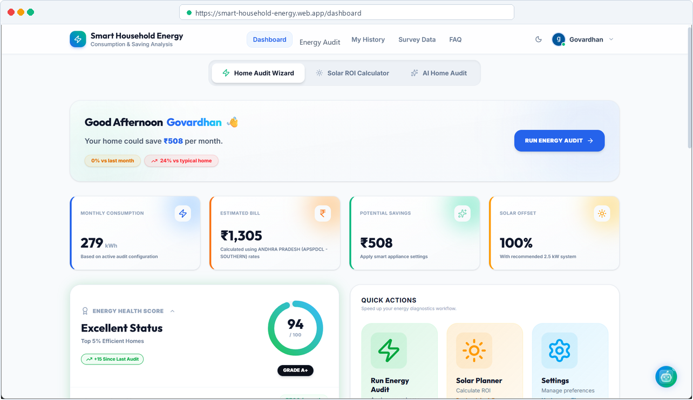
  <p><em>Executive dashboard with live telemetry cards, biggest consumer widgets, and energy health gauges.</em></p>
</div>

<div align="center">
  
</div>

---

## 🏗️ System Architecture

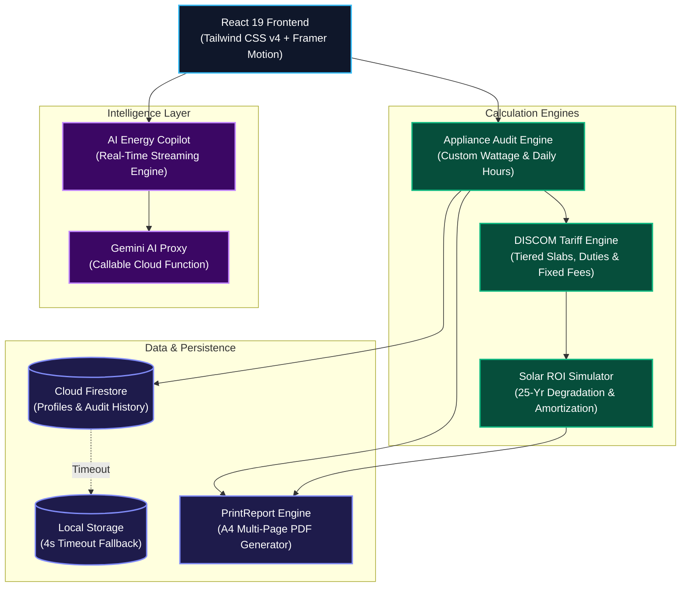

<div align="center">
  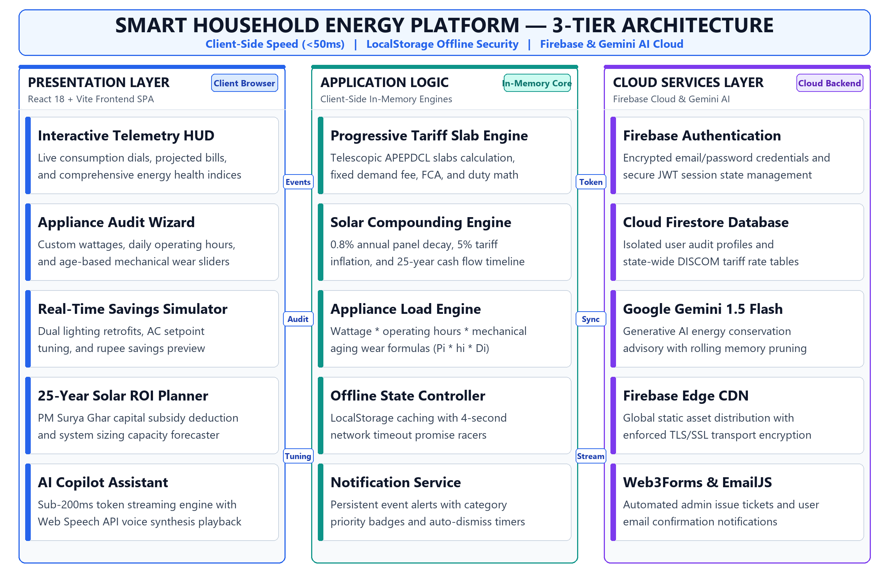
  <p><em>Detailed end-to-end component architecture and subsystem interaction pipeline.</em></p>
</div>

<div align="center">
  
</div>

---

## 🛠️ Tech Stack

| Domain | Technology | Purpose |
| :--- | :--- | :--- |
| **Frontend Core** | **React 19 + TypeScript** | Strongly typed component architecture with strict null checks |
| **Build & Tooling** | **Vite v8** | Sub-second HMR and production rollups (built in 2.6s) |
| **Styling** | **Tailwind CSS v4** | Dynamic CSS variables, dark/light theme switching, and glassmorphism |
| **Animation** | **Framer Motion** | Physics-based micro-interactions, layout transitions, and fluid counters |
| **Visualizations** | **Recharts** | Accessible SVG charts (Line, Bar, Pie) with screen-reader table fallbacks |
| **Artificial Intelligence** | **Google Gemini AI** | Multimodal reasoning, conversational advice, and word-by-word streaming |
| **Backend & Auth** | **Firebase (Auth + Firestore)** | Cloud persistence, user authentication, and secure config proxification |
| **Testing** | **Vitest** | Fast unit and integration tests across calculation engines and flows |
| **Code Quality** | **ESLint 9 + React Hooks** | Enforcing Rules of Hooks and standard React clean code patterns |

<div align="center">
  
</div>

---

## 🧪 Testing & Verification

The codebase maintains **100% test pass rate** across all calculation engines, state flows, and services:

```text
 ✓ src/services/notificationService.test.ts (6 tests)
 ✓ src/services/applianceServices.test.ts    (10 tests)
 ✓ src/utils/authFlow.test.ts               (3 tests)
 ✓ src/utils/tariffCalculator.test.ts       (6 tests)
 ✓ src/utils/solarCalculator.test.ts        (5 tests)
 ✓ src/utils/auditFlow.test.ts              (27 tests)
 ✓ src/utils/auditEngine.test.ts            (17 tests)
 ✓ src/utils/sanitizer.test.ts              (4 tests)

 Test Files  8 passed (8)
      Tests  78 passed (78)
   Duration  2.12s
```

Run test suites locally:
```bash
npm test
```

Execute TypeScript type checking:
```bash
npx tsc -b
```

Run ESLint verification:
```bash
npx eslint src
```

---

## ⚡ Getting Started

### Prerequisites
* **Node.js** `v18.0.0` or higher
* **npm** `v9.0.0` or higher

### Installation

1. **Clone the repository:**
   ```bash
   git clone https://github.com/govardhan-cyber/smart-household-energy.git
   cd smart-household-energy
   ```

2. **Install project dependencies:**
   ```bash
   npm install
   ```

3. **Configure Environment Variables:**
   Copy the example environment configuration:
   ```bash
   cp .env.example .env.local
   ```
   *(Add your Firebase API keys and Gemini API key to `.env.local`. If left unset, the app will operate seamlessly in local offline mock mode.)*

4. **Launch the development server:**
   ```bash
   npm run dev
   ```
   Open [http://localhost:5173](http://localhost:5173) in your browser.

5. **Build for production:**
   ```bash
   npm run build
   ```

---

## 🏷️ Version History

The project adheres to structured version tagging. Key historical releases include:

* **Version 26 (`version-26`)**: Comprehensive code quality hardening, 15 core bug fixes, complete type-safety refactor eliminating loose `any` casts, Rules-of-Hooks resolution in `ThreeDCard.tsx`, Recharts tooltip decoupling in `SurveyData.tsx`, and zero ESLint errors across 78 passing tests.
* **Version 25 (`version-25`)**: Modular ChatBot architecture, ultra-fast streaming AI responses, 6-turn history pruning, and distinct 4-theme telemetry cards.
* **Version 24 (`version-24`)**: Enhanced notification center with persistent storage, dynamic custom wattage overrides, and TS7030 compliance.
* **Version 23 (`version-23`)**: 4-second Firestore timeout racer fallback to local storage and UI startup lag optimizations.
* **Version 22 (`version-22`)**: Dual Web3Forms and EmailJS reporting pipeline.
* **Version 21 (`version-21`)**: Unified multi-page PDF booklet generation and SaaS-style diagnostics dashboard.

To recover any specific release:
```bash
git checkout version-26
```

---

## 📄 License

Distributed under the **MIT License**. See [`LICENSE`](./LICENSE) for more information.

---

<div align="center">
  <p>Developed with ❤️ by <a href="https://github.com/govardhan-cyber">Govardhan Rao</a></p>
  <p>
    <a href="https://smart-household-energy.web.app" target="_blank">🌐 Live Web Application</a> •
    <a href="https://github.com/govardhan-cyber/smart-household-energy/issues">🐛 Report Bug</a> •
    <a href="https://github.com/govardhan-cyber/smart-household-energy/pulls">💡 Request Feature</a>
  </p>
</div>
